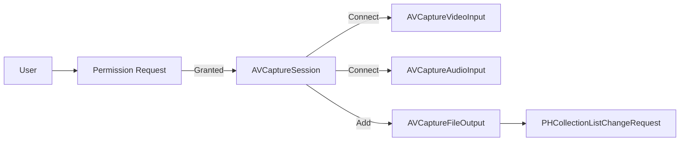
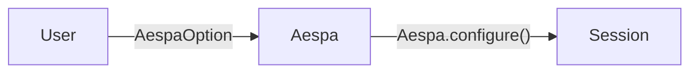
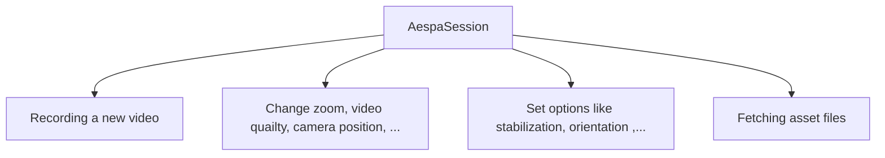
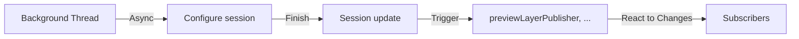

## Introduction
Aespa is a robust and intuitive Swift package for video capturing, built with a focus on the ease of setting up and usage. 

**This package provides a high-level API over Apple's `AVFoundation` framework**: abstracting away its complexity and making it straightforward for developers to implement video capturing functionalities in their iOS applications.

**This package provides a clean, user-friendly API for common video recording tasks**: including starting and stopping recording, managing audio settings, adjusting video quality, setting camera position, etc.


## Features
### User-friendly Interface
*Before*

**Aespa**


- Aespa provides an accessible API that abstracts the complexity of `AVFoundation`, allowing you to manage video capturing tasks with ease.

### Adaptable Configuration & Custom Tuning

- With Aespa, you can readily adjust a variety of settings. 
- For a higher degree of customization, it also supports the creation of custom tunings for the recording session, offering flexible control over your recording needs.

### Reactive Programming & Async Support

- Aespa's API leverages Swift's latest concurrency model to provide asynchronous functions, ensuring smooth and efficient execution of tasks.
- Additionally, it is built with `Combine` in mind, enabling you to handle updates such as video output and preview layer  reactively using publishers and subscribers.

### Error Handling
- The package provides comprehensive error handling, allowing you to build robust applications with minimal effort.

> **Note**
> Aespa is designed to be easy to use for both beginners and experienced developers. 
> 
> If you're new to video recording on iOS or if you're looking to simplify your existing recording setup, Aespa could be the perfect fit for your project.

## Usage
### Requirements
- Swift 5.4+
- iOS 14.0+

### Getting started
``` Swift
let aespaOption = AespaOption(albumName: "YOUR_ALBUM_NAME")
let aespaSession = Aespa.session(with: aespaOption)

Task(priority: .background) {
    try await Aespa.configure()
}
```
> **Warning**
> Please ensure to call `configure` within a background execution context. Neglecting to do so may lead to significantly reduced responsiveness in your application. ([reference](https://developer.apple.com/documentation/avfoundation/avcapturesession/1388185-startrunning))

### Now you can use...
See more details in our :book: [wiki](https://github.com/enebin/Aespa/wiki)!
- [Aespa's method](https://github.com/enebin/Aespa/wiki/Aespa's-method)
- [Aespa's publisher](https://github.com/enebin/Aespa/wiki/Aespa's-publisher)


## Implementation Exapmles
### Start & stop recording
``` Swift
do {
    try aespaSession
        .setStabilization(mode: .auto)
        .setPosition(to: .front)
        .setQuality(to: .hd1920x1080)
        .mute()
        .startRecording()
} catch {
    print("Failed to start recording")
}

// Later...
try? aespaSession.stopRecording()

```

### Subscribing publihser
``` Swift 
// Subscribe file publisher 
aespaSession.videoFilePublisher
    .receive(on: DispatchQueue.global(qos: .utility))
    .sink { [weak self] status in
        guard let self else { return }
        
        if case .failure(let error) = status {
            // Handle error in here...
            // ex. try? self.stopRecordingVideo()
        } else {
            // Handle captured file in here...
        }
    }
    .store(in: &subsriptions)
```
Based on the code provided, here is a draft for a README file that includes this functionality:

## SwiftUI Integration

Aespa also provides a super-easy way to integrate video capture functionality into SwiftUI applications. AespaSession includes a helper method to create a SwiftUI `UIViewRepresentable` that provides a preview of the video capture.

### Example usage

```swift
import Aespa
import SwiftUI

struct VideoContentView: View {
    @ObservedObject private var viewModel = VideoContentViewModel()
    
    var body: some View {
        ZStack {
            viewModel.preview
                .frame(minWidth: 0,
                       maxWidth: .infinity,
                       minHeight: 0,
                       maxHeight: .infinity)
                .edgesIgnoringSafeArea(.all)
        }
    }
}

class VideoContentViewModel: ObservableObject {
    let aespaSession: AespaSession
    var preview: some UIViewRepresentable {
        aespaSession.preview()
    }
    
    init() {
        let option = AespaOption(albumName: "Aespa-Demo")
        self.aespaSession = Aespa.session(with: option)
        
        Task(priority: .background) {
            do {
                try await Aespa.configure()
            } catch let error {
                print(error)
            }
        }
    }
}
```
> **Note**: You can find the demo app in here([Aespa-iOS](https://github.com/enebin/Aespa-iOS))

> **Note**: In UIKit, you can access the preview through the `previewLayer` property of `AespaSession`. 
> 
> For more details, refer to the [AVCaptureVideoPreviewLayer](https://developer.apple.com/documentation/avfoundation/avcapturevideopreviewlayer).in the official Apple documentation.

## Contributing
Contributions to Aespa are warmly welcomed. Please feel free to submit a pull request or create an issue if you find a bug or have a feature request.

## License
Aespa is available under the MIT license. See the LICENSE file for more info.
