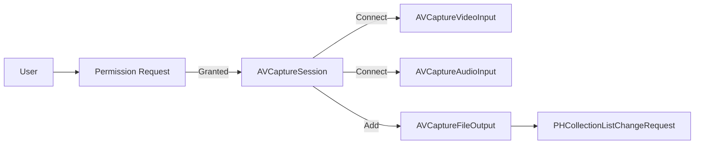
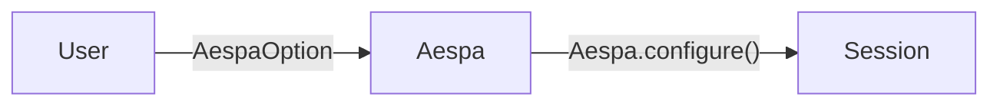
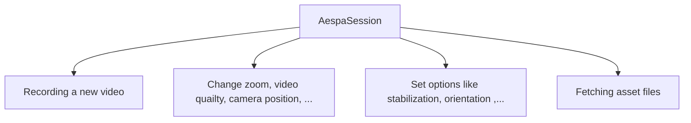
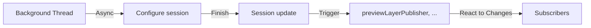

Aespa. Ready-to-go package for easy and intuitive camera handling

## Introduction
Aespa is a robust and intuitive Swift package for video capturing, built with a focus on the ease of setting up and usage. 

- **This package provides a high-level API over Apple's `AVFoundation` framework**, abstracting away its complexity and making it straightforward for developers to implement video capturing functionalities in their iOS applications.

- **This package provides a clean, user-friendly API for common video recording tasks**, including starting and stopping recording, managing audio settings, adjusting video quality, setting camera position, etc.


## Features
### User-friendly Interface
*Before*

**Aespa**


- Aespa provides an accessible API that abstracts the complexity of `AVFoundation`, allowing you to manage video capturing tasks with ease.

### Adaptable Configuration & Custom Tuning

- With Aespa, you can readily adjust a variety of settings. 
- For a higher degree of customization, it also supports the creation of custom tunings for the recording session, offering flexible control over your recording needs.

### Reactive Programming & Async Support

- Aespa's API leverages Swift's latest concurrency model to provide asynchronous functions, ensuring smooth and efficient execution of tasks.
- Additionally, it is built with `Combine` in mind, enabling you to handle updates such as video output and preview layer  reactively using publishers and subscribers.

### Error Handling
- The package provides comprehensive error handling, allowing you to build robust applications with minimal effort.

> **Note**
> Aespa is designed to be easy to use for both beginners and experienced developers. 
> 
> If you're new to video recording on iOS or if you're looking to simplify your existing recording setup, Aespa could be the perfect fit for your project.

## Usage
### Requirements
- Swift 5.4+
- iOS 14.0+

### Getting started
``` Swift
let aespaOption = AespaOption(albumName: "YOUR_ALBUM_NAME")
let aespaSession = Aespa.session(with: aespaOption)

Task(priority: .background) {
    try await Aespa.configure()
}
```
> **Warning**
> Please ensure to call `configure` within a background execution context. Neglecting to do so may lead to significantly reduced responsiveness in your application. ([reference](https://developer.apple.com/documentation/avfoundation/avcapturesession/1388185-startrunning))

### Now you can use...
<details>
<summary>Methods - description</summary>

#### Audio

```swift
mute() throws -> Self
```
- Used to mute the audio during a recording session. 

```swift
unmute() throws -> Self
```
- Used to add the audio for a recording session.

#### Options

```swift
setQuality(to preset: AVCaptureSession.Preset) throws -> Self
```
- Used to adjust the quality of the recording session. 
- It accepts a parameter of type `AVCaptureSession.Preset` which is used to set the quality. 

```swift
setPosition(to position: AVCaptureDevice.Position) throws -> Self
```
- Used to set the position of the capture device (camera). 
- It accepts a parameter of type `AVCaptureDevice.Position` which can be front or back.

```swift
setOrientation(to orientation: AVCaptureVideoOrientation) -> Self
```
- Used to set the video orientation during a recording session.
- It accepts a parameter of type `AVCaptureVideoOrientation`.

```swift
setStabilization(mode: AVCaptureVideoStabilizationMode) -> Self
```
- Used to set the video stabilization mode. 
- It accepts a parameter of type `AVCaptureVideoStabilizationMode`. 

#### Zooming

```swift
zoom(factor: CGFloat) -> Self
```
- Used to adjust the zoom level during a recording session. 
- It accepts a `CGFloat` as an input for the zoom level.

#### Utilities

```swift
fetchVideoFiles(limit: Int = 0) -> [VideoFile]
```
- Used to fetch video files that were recorded. 
- It accepts an optional parameter to limit the number of fetched video files. 
- If no parameter is given, it returns all the recorded video files.

```swift
doctor() async throws
```
- This function is used to check the minimum required conditions for starting a recording session. 
- It checks for capture authorization status, session running status, connection existence, and device attachment. 
- If any of these checks fail, it throws an `AespaError`.

</details>


<details>
<summary>Publishers - description</summary>

```swift
videoFilePublisher: AnyPublisher<Result<VideoFile, Error>, Never>
```
- This publisher emits an event every time a video file is recorded.
- The event contains a `Result` that wraps a `VideoFile` instance in case of success, or an `Error` in case of failure. 
- The publisher never completes, which means it continues to emit events as long as the `AespaSession` instance is alive.

```swift
previewLayerPublisher: AnyPublisher<AVCaptureVideoPreviewLayer, Never>
```
- This publisher emits an `AVCaptureVideoPreviewLayer` instance whenever the preview layer is updated. 
- The `AVCaptureVideoPreviewLayer` instance can be used to display a camera preview on the user interface. 
- Similar to the `videoFilePublisher`, this publisher never completes and continues to emit events as long as the `AespaSession` instance is alive.

</details>


## Implementation Exapmles
### Start & stop recording
``` Swift
do {
    try aespaSession
        .setStabilization(mode: .auto)
        .setPosition(to: .front)
        .setQuality(to: .hd1920x1080)
        .mute()
        .startRecording()
} catch {
    print("Failed to start recording")
}

// Later...
try? aespaSession.stopRecording()

```

### Subscribing publihser
``` Swift 
// Subscribe file publisher 
aespaSession.videoFilePublisher
    .receive(on: DispatchQueue.global(qos: .utility))
    .sink { [weak self] status in
        guard let self else { return }
        
        if case .failure(let error) = status {
            // Handle error in here...
            // ex. try? self.stopRecordingVideo()
        } else {
            // Handle captured file in here...
        }
    }
    .store(in: &subsriptions)
```

## Contributing
Contributions to Aespa are warmly welcomed. Please feel free to submit a pull request or create an issue if you find a bug or have a feature request.

## License
Aespa is available under the MIT license. See the LICENSE file for more info.
