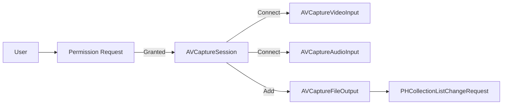
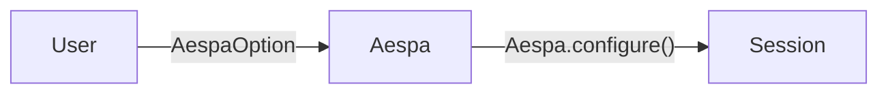
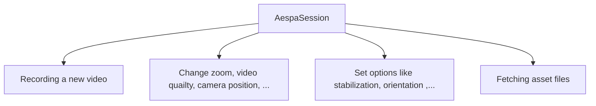
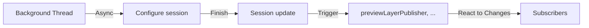

[](https://swiftpackageindex.com/enebin/Aespa)
[](https://swiftpackageindex.com/enebin/Aespa)
[](https://github.com/apple/swift-package-manager)


<div align="center">

### Add a camera in just 3 lines

</div>

``` Swift 
let aespaOption = AespaOption(albumName: "YOUR_ALBUM_NAME")
let aespaSession = Aespa.session(with: aespaOption)
try await Aespa.configure()
// Done!
```

### Quick link

- **Demo app & usage example** can be found in [here](https://github.com/enebin/Aespa-iOS/tree/main/Aespa-iOS)
- **Latest API documentation** can be found in [here](https://enebin.github.io/Aespa/documentation/aespa/)

### Index

- [Introduction](#Introduction)
- [Features](#Features)
    - [Super Easy to Use](#Super-Easy-to-Use)
    - [Offer Essential Preset Configuration & Customization](#Offer-Essential-Preset-Configuration-&-Customization)
    - [`Combine` & `async` Support](#Combine-&-async-Support)
    - [Comprehensive Error Handling](#Comprehensive-Error-Handling)
- [Functionality](#Functionality)
- [Installation](#Installation)
    - [Swift Package Manager (SPM)](#Swift-Package-Manager-(SPM))
- [Usage](#Usage)
    - [Requirements](#Requirements)
    - [Getting Started](#Getting-Started)
- [Implementation Examples](#Implementation-Examples)
    - [Configuration](#Configuration)
    - [Recording & Capture](#Recording-&-Capture)
- [SwiftUI Integration](#SwiftUI-Integration)
    - [Example Usage](#Example-Usage)
- [Contributing](#Contributing)
- [License](#License)

---

## Introduction
Aespa is a robust and intuitive Swift package for video capturing, built with a focus on the ease of setting up and usage. 

**This package provides a high-level API over Apple's `AVFoundation` framework**: abstracting away its complexity and making it straightforward for developers to implement video capturing functionalities in their iOS applications.

**This package provides a clean, user-friendly API for common video recording tasks**: including starting and stopping recording, managing audio settings, adjusting video quality, setting camera position, etc.


## Features
Aespa is designed to be easy to use for both beginners and experienced developers.  If you're new to video recording on iOS or if you're looking to simplify your existing recording setup, Aespa could be the perfect fit for your project.

<details>
<summary> ✅ Super easy to use </summary>

*Before*

**Aespa**


- Aespa provides an accessible API that abstracts the complexity of `AVFoundation`, allowing you to manage video capturing tasks with ease.

</details>

<details>
<summary> ✅ Offer essential preset configuration & customization </summary>


- With Aespa, you can readily adjust a variety of settings. 
- For a higher degree of customization, it also supports the creation of custom tunings for the recording session, offering flexible control over your recording needs.

</details>

<details>
<summary> ✅ Combine & async support </summary>


- Aespa's API leverages Swift's latest concurrency model to provide asynchronous functions, ensuring smooth and efficient execution of tasks.
- Additionally, it is built with `Combine` in mind, enabling you to handle updates such as video output and preview layer  reactively using publishers and subscribers.

</details>

<details>
<summary> ✅ Comprehensive error handling </summary>

- The package provides comprehensive error handling, allowing you to build robust applications with minimal effort.

</details>

## Functionality

> **Note**
> 
> You can access our **official documentation** for the most comprehensive and up-to-date explanations in [here](https://enebin.github.io/Aespa/documentation/aespa/)

| Common                           | Description                                                                                                      |
|----------------------------------|------------------------------------------------------------------------------------------------------------------|
| ✨ `zoom`                           | Modifies the zoom factor.                                                                                        |
| ✨ `setPosition`                    | Changes the camera position.                                                                                     |
| `setOrientation`                 | Modifies the orientation.                                                                                        |
| `setAutofocusing`                | Alters the autofocusing mode.                                                                                    |
| `setQuality`                     | Adjusts the video quality preset for the recording session.                                                      |
| `doctor`                         | Checks if essential conditions to start recording are satisfied.                                                 |
| `previewLayerPublisher`          | Responsible for emitting updates to the preview layer.                                                           |

| Video                            | Description                                                                                                      |
|----------------------------------|------------------------------------------------------------------------------------------------------------------|
| ✨ `startRecording`      | Initiates the recording of a video session.                                                                      |
| ✨ `stopRecording`              | Terminates the current video recording session and attempts to save the video file.                              |
| `mute`                           | Mutes the audio input.                                                                                           |
| `unmute`                         | Restores the audio input.                                                                                        |
| `setStabilization`               | Alters the stabilization mode.                                                                                   |
| `setTorch`                       | Adjusts the torch mode and level.                                                                                |
| `customize`                      | Customizes the session with a specific tuning configuration.                                                     |
| ✨ `fetchVideoFiles`                | Fetches a list of recorded video files.                                                                          |
| `videoFilePublisher`             | Emits a `Result` object containing a latest video file data.                          |

| Photo                            | Description                                                                                                      |
|----------------------------------|------------------------------------------------------------------------------------------------------------------|
| ✨ `capturePhoto`               | Capture a photo and returns a result image file.          |
| ✨ `setFlashMode`                   | Sets the flash mode for the photo capture session.                                                               |
| `redEyeReduction`                | Enables or disables red-eye reduction for the photo capture session.                                             |
| `customize`                      | Customizes the photo capture session with a specific `AVCapturePhotoSettings`.                                   |
| ✨ `fetchPhotoFiles`                | Fetches a list of captured photos files.                                                                          |
| `photoFilePublisher`             | Emits a `Result` object containing a latest image file data.                            |

## Installation 
### Swift Package Manager (SPM)
Follow these steps to install **Aespa** using SPM:

1. From within Xcode 13 or later, choose `File` > `Swift Packages` > `Add Package Dependency`.
2. At the next screen, enter the URL for the **Aespa** repository in the search bar then click `Next`.
``` Text
https://github.com/enebin/Aespa.git
```
3. For the `Version rule`, select `Up to Next Minor` and specify the current Aespa version then click `Next`.
4. On the final screen, select the `Aespa` library and then click `Finish`.

**Aespa** should now be integrated into your project 🚀

## Usage

> **Note**
>
> We offer an extensively detailed and ready-to-use code base for a SwiftUI app that showcases most of the package's features. 
> You can access it [here](https://github.com/enebin/Aespa-iOS).

### Requirements
- Swift 5.5+
- iOS 14.0+

### Getting started
``` Swift
import Aespa

let aespaOption = AespaOption(albumName: "YOUR_ALBUM_NAME")
let aespaSession = Aespa.session(with: aespaOption)

Task(priority: .background) {
    try await Aespa.configure()
}
```
> **Warning**
> 
> Please ensure to call `configure` within a background execution context. Neglecting to do so may lead to significantly reduced responsiveness in your application. ([reference](https://developer.apple.com/documentation/avfoundation/avcapturesession/1388185-startrunning))

## Implementation Exapmles
### Configuration
``` Swift
// Common setting
aespaSession
    .setAutofocusing(mode: .continuousAutoFocus)
    .setOrientation(to: .portrait)
    .setQuality(to: .high)
    .customize(WideColorCameraTuner())

// Photo-only setting
aespaSession
    .setFlashMode(to: .on)
    .redEyeReduction(enabled: true)

// Video-only setting
aespaSession
    .mute()
    .setStabilization(mode: .auto)         
```

### Recording & Capture
``` Swift
// Start recording
aespaSession.startRecording()
// Later... stop recording
aespaSession.stopRecording()

// Capture photo
aespaSession.capturePhoto()
```

## SwiftUI Integration

Aespa also provides a super-easy way to integrate video capture functionality into SwiftUI applications. AespaSession includes a helper method to create a SwiftUI `UIViewRepresentable` that provides a preview of the video capture.

### Example usage

```swift
import Aespa
import SwiftUI

struct VideoContentView: View {
    @StateObject private var viewModel = VideoContentViewModel()
    
    var body: some View {
        ZStack {
            viewModel.preview
                .frame(minWidth: 0,
                       maxWidth: .infinity,
                       minHeight: 0,
                       maxHeight: .infinity)
                .edgesIgnoringSafeArea(.all)
        }
    }
}

class VideoContentViewModel: ObservableObject {
    let aespaSession: AespaSession
    var preview: some UIViewRepresentable {
        aespaSession.preview()
    }
    
    init() {
        let option = AespaOption(albumName: "Aespa-Demo")
        self.aespaSession = Aespa.session(with: option)
        
        Task(priority: .background) {
            do {
                try await Aespa.configure()
                aespaSession
                    .setAutofocusing(mode: .continuousAutoFocus)
                    .setOrientation(to: .portrait)
                    .setQuality(to: .high)

                // Other settings ...
                
            } catch let error {
                print(error)
            }
        }
    }
}
```

> **Note**
> 
> In `UIKit`, you can access the preview through the `previewLayer` property of `AespaSession`. 
> For more details, refer to the [AVCaptureVideoPreviewLayer](https://developer.apple.com/documentation/avfoundation/avcapturevideopreviewlayer) in the official Apple documentation.

## Contributing
Contributions to Aespa are warmly welcomed. Please feel free to submit a pull request or create an issue if you find a bug or have a feature request.

## License
Aespa is available under the MIT license. See the LICENSE file for more info.
