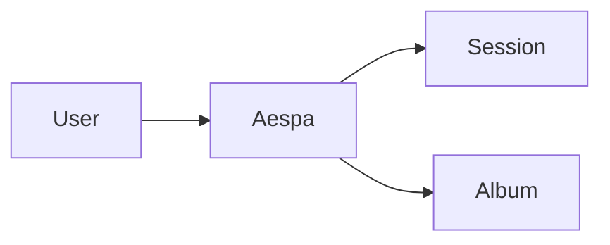

[](https://swiftpackageindex.com/enebin/Aespa)
[](https://swiftpackageindex.com/enebin/Aespa)
[](https://github.com/apple/swift-package-manager)


<div align="center">

### From camera to album. In just 2 lines.

</div>

``` Swift 
let aespaOption = AespaOption(albumName: "YOUR_ALBUM_NAME")
let aespaSession = Aespa.session(with: aespaOption)
// Done!
```

### Quick link

- **Demo app & usage example** can be found in [here](https://github.com/enebin/Aespa/tree/main/Demo/Aespa-iOS)
- **Latest API documentation** can be found in [here](https://enebin.github.io/Aespa/documentation/aespa/)

### Index
- [Introduction](#Introduction)
    - [Super Easy to Use](#Super-Easy-to-Use)
    - [No more delegate](#No-more-delegate)
    - [Also](#Also)
- [Functionality](#Functionality)
- [Installation](#Installation)
    - [Swift Package Manager (SPM)](#Swift-Package-Manager-(SPM))
- [Usage](#Usage)
    - [Requirements](#Requirements)
    - [Getting Started](#Getting-Started)
- [Implementation Examples](#Implementation-Examples)
    - [Configuration](#Configuration)
    - [Recording & Capture](#Recording-&-Capture)
- [SwiftUI Integration](#SwiftUI-Integration)
    - [Example Usage](#Example-Usage)
- [Contributing](#Contributing)
- [License](#License)

---

## Introduction

Aespa is a robust and intuitive Swift package for video and photo capturing, built with a focus on the ease of setting up and usage.

It is designed to be easy to use from beginners to intermediate developers. If you're new to video recording on iOS or if you're looking to simplify your existing camera setup, Aespa could be the perfect fit for your project.


#### Super easy to use

<details>
<summary> Zip the boring configuration for session & album </summary>

*Before*


**Aespa**


- Aespa provides an accessible API that abstracts the complexity of `AVFoundation`, allowing you to manage video capturing tasks with ease.

</details>

<details>
<summary> Offer essential preset configuration & customization </summary>


- With Aespa, you can readily adjust a variety of settings. 
- For a higher degree of customization, it also supports the creation of custom tunings for the recording session, offering flexible control over your recording needs.

</details>

<details>
<summary> Comprehensive error handling </summary>

- The package provides comprehensive error handling, allowing you to build robust applications with minimal effort.

</details>

#### No more delegate
<details>

<summary> Combine support </summary>


- Aespa's API leverages Swift's latest concurrency model to provide asynchronous functions, ensuring smooth and efficient execution of tasks.
- Additionally, it is built with `Combine` in mind, enabling you to handle updates such as video output and preview layer  reactively using publishers and subscribers.

</details>

#### Also
- Automated system permission management.
- Seamless image and video capture within a single preview session.
- Thread-safe.
- Support SPM.


## Functionality

> **Note**
> 
> You can access our **official documentation** for more comprehensive and up-to-date explanations in [here](https://enebin.github.io/Aespa/documentation/aespa/)

### Manual options
| Common                           | Description                                                                                                      |
|----------------------------------|------------------------------------------------------------------------------------------------------------------|
| ✨ `zoom`                        | Modifies the zoom factor.                                                                                        |
| ✨ `position`                 | Changes the camera position.                                                                                     |
| `orientation`                 | Modifies the orientation.                                                                                        |
| `focus`                       | Alters the autofocusing mode.                                                                                    |
| `quality`                     | Adjusts the video quality preset for the recording session.                                                      |
| `doctor`                         | Checks if essential conditions to start recording are satisfied.                                                 |
| `previewLayerPublisher`          | Responsible for emitting updates to the preview layer.                                                           |

| Video                            | Description                                                                                                      |
|----------------------------------|------------------------------------------------------------------------------------------------------------------|
| ✨ `startRecording`      | Initiates the recording of a video session.                                                                      |
| ✨ `stopRecording`              | Terminates the current video recording session and attempts to save the video file.                              |
| `mute`                           | Mutes the audio input.                                                                                           |
| `unmute`                         | Restores the audio input.                                                                                        |
| `stabilization`               | Alters the stabilization mode.                                                                                   |
| `torch`                       | Adjusts the torch mode and level.                                                                                |
| `customize`                      | Customizes the session with a specific tuning configuration.                                                     |
| ✨ `fetchVideoFiles`                | Fetches a list of recorded video files.                                                                          |
| `videoFilePublisher`             | Emits a `Result` object containing a latest video file data.                          |

| Photo                            | Description                                                                                                      |
|----------------------------------|------------------------------------------------------------------------------------------------------------------|
| ✨ `capturePhoto`               | Capture a photo and returns a result image file.          |
| ✨ `flashMode`                   | Sets the flash mode for the photo capture session.                                                               |
| `redEyeReduction`                | Enables or disables red-eye reduction for the photo capture session.                                             |
| `customize`                      | Customizes the photo capture session with a specific `AVCapturePhotoSettings`.                                   |
| ✨ `fetchPhotoFiles`                | Fetches a list of captured photos files.                                                                          |
| `photoFilePublisher`             | Emits a `Result` object containing a latest image file data.                            |

### `InteractivePreview`
One of main features, `InteractivePreview` provides a preset session for those who don't want to do complicated configurations.

| Features               | Description                                                             |
|------------------------|------------------------------------------------------------------------------------------------------------------|
| Double tap to change camera  | Switches between the front and back camera upon double tapping.                                                  |
| Pinch zoom          | Allows zooming in or out on the preview by using a pinch gesture.                                                |


## Installation 
### Swift Package Manager (SPM)
Follow these steps to install **Aespa** using SPM:

1. From within Xcode 13 or later, choose `File` > `Swift Packages` > `Add Package Dependency`.
2. At the next screen, enter the URL for the **Aespa** repository in the search bar then click `Next`.
``` Text
https://github.com/enebin/Aespa.git
```
3. For the `Version rule`, select `Up to Next Minor` and specify the current Aespa version then click `Next`.
4. On the final screen, select the `Aespa` library and then click `Finish`.

**Aespa** should now be integrated into your project 🚀.

## Usage

> **Note**
>
> We offer an extensively detailed and ready-to-use code base for a SwiftUI app that showcases most of the package's features. 
> You can access it [here, the demo app](https://github.com/enebin/Aespa/tree/main/Demo/Aespa-iOS).

### Requirements
- Swift 5.5+
- iOS 14.0+

### Getting started
```swift
import Aespa
```

<!-- INSERT_CODE: GETTING_STARTED -->
```swift
let option = AespaOption(albumName: "YOUR_ALBUM_NAME")
let aespaSession = Aespa.session(with: option)
```
<!-- INSERT_CODE: END -->

## Implementation Examples
### Configuration
<!-- INSERT_CODE: COMMON_SETTING -->
```swift
// Common setting
aespaSession
    .common(.focus(mode: .continuousAutoFocus))
    .common(.changeMonitoring(enabled: true))
    .common(.orientation(orientation: .portrait))
    .common(.quality(preset: .high))
    .common(.custom(tuner: WideColorCameraTuner())) { result in
        if case .failure(let error) = result {
            print("Error: ", error)
        }
    }
```
<!-- INSERT_CODE: END -->

<!-- INSERT_CODE: PHOTO_SETTING -->
```swift
// Photo-only setting
aespaSession
    .photo(.flashMode(mode: .on))
    .photo(.redEyeReduction(enabled: true))
```
<!-- INSERT_CODE: END -->

<!-- INSERT_CODE: VIDEO_SETTING -->
```swift
// Video-only setting
aespaSession
    .video(.mute)
    .video(.stabilization(mode: .auto))
```
<!-- INSERT_CODE: END -->

### Recording & Capture
<!-- INSERT_CODE: RECORDING_AND_CAPTURE -->
```swift
// Start recording
aespaSession.startRecording()
// Later... stop recording
aespaSession.stopRecording()
// Capture photo
aespaSession.capturePhoto()
```
<!-- INSERT_CODE: END -->

### Get result
<!-- INSERT_CODE: GET_RESULT -->
```swift
aespaSession.stopRecording { result in
    switch result {
    case .success(let file):
        print(file.path) // file://some/path
    case .failure(let error):
        print(error)
    }
}

// or...
Task {
    let files = await aespaSession.fetchVideoFiles(limit: 1)
}

// or you can use publisher
aespaSession.videoFilePublisher.sink { result in
    print(result)
}
```
<!-- INSERT_CODE: END -->

## SwiftUI Integration
Aespa also provides a super-easy way to integrate video capture functionality into SwiftUI applications. `AespaSession` includes a helper method to create a SwiftUI `UIViewRepresentable` that provides a preview of the video capture.

### Example usage
<!-- INSERT_CODE: SWIFTUI_INTEGRATION -->
```swift
import Aespa
import SwiftUI

struct VideoContentView: View {
    @StateObject private var viewModel = VideoContentViewModel()

    var body: some View {
        ZStack {
            viewModel.preview
                .frame(minWidth: 0,
                       maxWidth: .infinity,
                       minHeight: 0,
                       maxHeight: .infinity)
                .edgesIgnoringSafeArea(.all)
        }
    }
}

class VideoContentViewModel: ObservableObject {
    let aespaSession: AespaSession
    var preview: some View {
        aespaSession.interactivePreview()
    }

    init() {
        let option = AespaOption(albumName: "YOUR_ALBUM_NAME")
        self.aespaSession = Aespa.session(with: option)

        setUp()
    }

    func setUp() {
        aespaSession
            .common(.quality(preset: .high))

        // Other options
        // ...
    }
}
```
<!-- INSERT_CODE: END -->

> **Note**
> 
> In `UIKit`, you can access the preview through the `previewLayer` property of `AespaSession`. 
> For more details, refer to the [AVCaptureVideoPreviewLayer](https://developer.apple.com/documentation/avfoundation/avcapturevideopreviewlayer) in the official Apple documentation.

## Contributing
Contributions to Aespa are warmly welcomed. Please feel free to submit a pull request or create an issue if you find a bug or have a feature request.

## License
Aespa is available under the MIT license. See the LICENSE file for more info.
